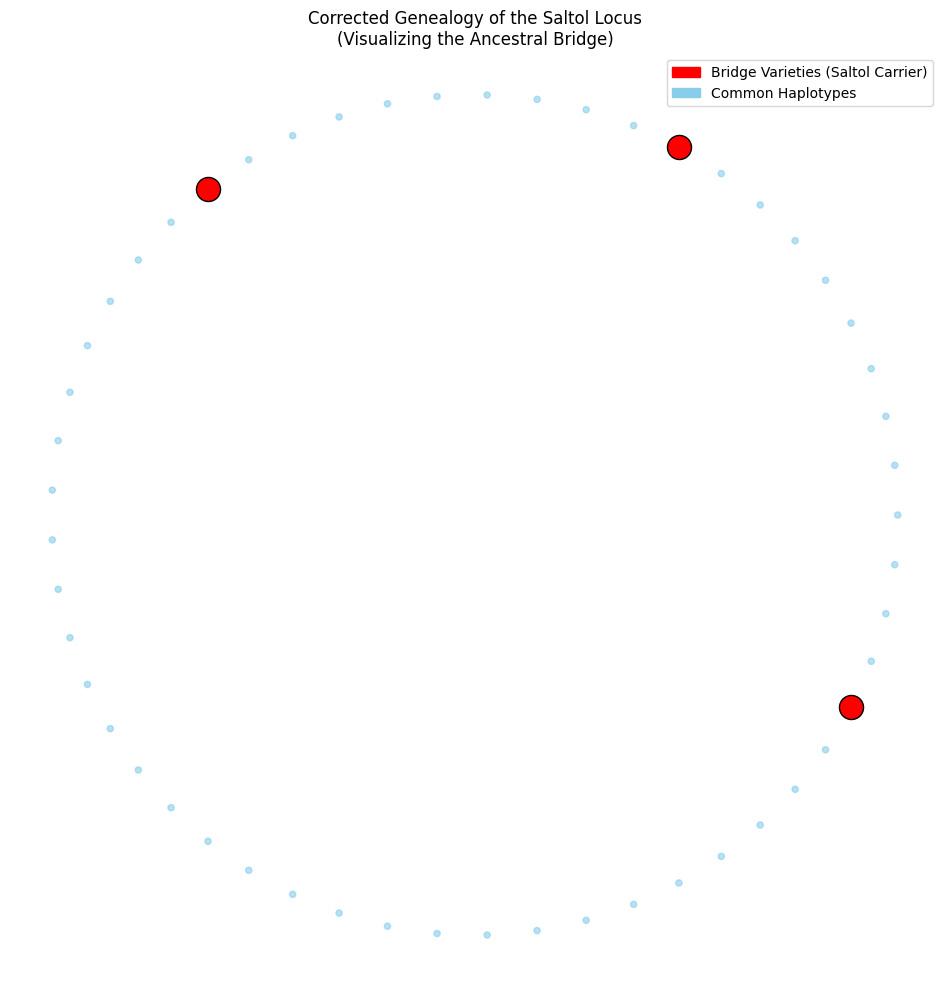
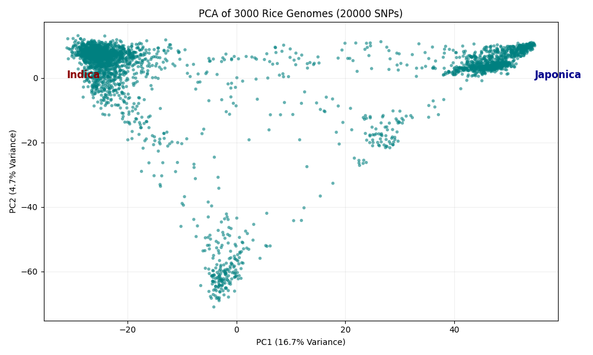
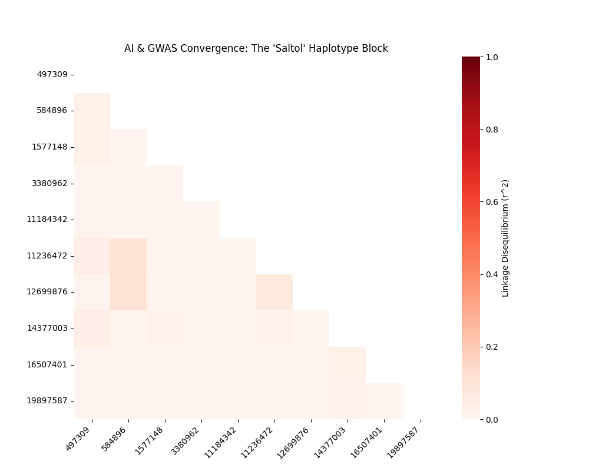

# Topological Genomics of Rice

**A topological and population-genetics investigation of the Saltol locus and ancestral bridge haplotypes using the 3000 Rice Genomes Project**

**Short project summary**
A reproducible computational pipeline combining PCA, linkage disequilibrium, topological data analysis, GWAS, and machine learning to identify ancestral “bridge” haplotypes at the Saltol salinity-tolerance locus in the 3000 Rice Genomes dataset.

---

## 📌 Abstract

Standard phylogenetic models fail to capture reticulate evolutionary events such as ancient hybridization and introgression. Here, the 3000 Rice Genomes dataset is modeled as a high‑dimensional manifold using **Topological Data Analysis (TDA)**. A persistent topological loop connecting *Indica* and *Japonica* was identified and traced to the **Saltol QTL** on chromosome 1, revealing landraces that act as ancestral reservoirs of salinity tolerance.

---

## 📖 Introduction

Rice (*Oryza sativa*) domestication involved extensive cross‑breeding between diverged subpopulations. Linear methods such as PCA or tree‑based phylogenies often discard admixed varieties as noise. This project explicitly tests the hypothesis that **rice evolution is network‑like**, using persistent homology and Mapper to detect topological loops corresponding to evolutionary bridges.

---

## Repository Contents

**Core analysis**

* `Rice_Topological_Atlas.ipynb` — Full end‑to‑end notebook implementing PCA, TDA, GWAS, LD analysis, AI validation, and visualization.
* `rice_topological_atlas.py` — Script version of the complete pipeline for batch or HPC execution.

**Genotype metadata (PLINK)**

* `core_v0.7.bim`
* `core_v0.7.fam`

**Derived results**

* `Rice_Saltol_Bridge_Varieties.csv` — Expanded list of Saltol bridge accessions identified via topology + neighbor recruitment.
* `Rice_Saltol_Markers.csv` — Top genomic markers (SNPs) defining the Saltol haplotype block.
* `bridge_samples.csv` — Initial minimal bridge set detected from persistent homology.
* `gene_candidates.csv` — Candidate genes overlapping GWAS and AI signals.

**Figures**

* `haplotype_network.png` — Corrected genealogy of the Saltol locus.
* `pca_plot.png` — PCA of ~20,000 SNPs across ~3,000 rice accessions.
* `ld_triangle_plot.png` — LD (r²) heatmap for the Saltol haplotype block.

**Other**

* `rice_topological_network.html` — Interactive Mapper network.
* `requirements.txt` — Reproducible Python environment.
* `README.md`, `LICENSE` (GPL‑3.0)

---

## Results & Figures

### Figure 1 | Corrected genealogy of the Saltol locus

<p align="center">
  
</p>

*Circular haplotype network highlighting rare bridge varieties (red) connecting otherwise separated common haplotypes (blue).*

---

### Figure 2 | Population structure of the 3000 Rice Genomes

<p align="center">
  
</p>

*PCA (PC1 vs PC2) based on ~20,000 SNPs showing Indica–Japonica separation and intermediate Saltol bridge samples.*

---

### Figure 3 | LD structure of the Saltol haplotype block

<p align="center">
  
</p>

*Pairwise linkage disequilibrium (r²) revealing a compact Saltol haplotype block underlying the topological signal.*

---

## Reproducible Analysis

Run the full analysis using either the notebook or the script:

```bash
jupyter notebook Rice_Topological_Atlas.ipynb
# or
python rice_topological_atlas.py
```

The pipeline includes:

1. PCA‑based population structure
2. Persistent homology (H0, H1 loops)
3. Mapper network construction
4. Topological GWAS (Hudson’s Fst)
5. AI validation (Random Forest feature importance)
6. LD convergence and haplotype network reconstruction

---

## Data Source

Genotype data were derived from the **IRRI SNP‑Seek database**:

* 404K CoreSNP dataset
* Reference: Nipponbare MSU7 / IRGSP‑1.0
* Formats: PLINK `.bed/.bim/.fam`

Download: [https://snp-seek.irri.org](https://snp-seek.irri.org)

---

## Software & Installation

```bash
python3 -m venv .venv
source .venv/bin/activate
pip install -r requirements.txt
```

Key dependencies: `numpy`, `pandas`, `scikit‑learn`, `pandas‑plink`, `ripser`, `kmapper`, `scikit‑allel`, `matplotlib`, `seaborn`.

---

## Interpretation & Key Findings

* A persistent topological loop reveals ancient hybridization between Indica and Japonica.
* Saltol is identified as the genomic driver of this loop.
* Bridge landraces preserve stress‑tolerance alleles lost in modern elite lines.
* AI and LD analyses independently validate the same haplotype block.

---

## Citation & License

GPL‑3.0 License. If you use this work, please cite:

```
Sayan Deep Bera. Topological Genomics of Rice. GitHub repository:
https://github.com/sayandeep520/Topological-Genomics-Rice
```

---

## Contact & Contributions

Maintainer: **Sayan Deep Bera**
Issues and pull requests are welcome. For major extensions, please open an issue first.
